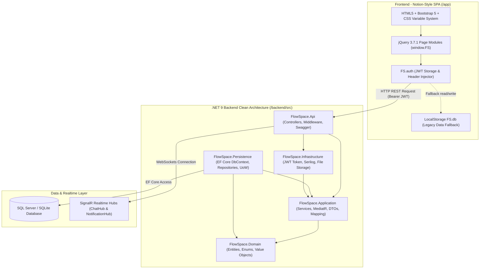

# TÀI LIỆU TOÀN CẢNH KIẾN TRÚC HỆ THỐNG FLOWSPACE (ARCHITECTURE OVERVIEW)

Tài liệu này tổng hợp kiến trúc tổng quan của dự án **FlowSpace**, đóng vai trò là bản đồ định hướng tích hợp giữa Frontend SPA và Backend .NET 9 Clean Architecture. Tài liệu tham chiếu chéo tới các tài liệu thiết kế chi tiết sẵn có để đảm bảo tính nhất quán và không lặp lại thông tin.

---

## 1. Bản đồ Tham chiếu Tài liệu Kiến trúc

- **Thiết kế Chi tiết Backend (.NET 9 Clean Architecture, CQRS, SignalR, Security, Database Schema)**: 
  Tham chiếu trực tiếp đến file [BACKEND_DESIGN.md](file:///e:/flowspace-fe/BACKEND_DESIGN.md).
- **Phân tích Chi tiết Frontend (HTML5/Bootstrap5/jQuery SPA, Design System, Offcanvases, Event Handlers, LocalStorage mock)**: 
  Tham chiếu trực tiếp đến file [FRONTEND_ANALYSIS.md](file:///e:/flowspace-fe/FRONTEND_ANALYSIS.md).
- **Đặc tả RESTful APIs đang vận hành**: 
  Tham chiếu trực tiếp đến file [API_DOCUMENT.md](file:///e:/flowspace-fe/API_DOCUMENT.md).
- **Cấu trúc Cơ sở Dữ liệu & Relational Model**: 
  Tham chiếu trực tiếp đến các file [DATABASE.md](file:///e:/flowspace-fe/DATABASE.md) và [DATABASE_SETUP.sql](file:///e:/flowspace-fe/DATABASE_SETUP.sql).

---

## 2. Mô hình Sơ đồ Tổng quan Hệ thống (System Architecture Diagram)



---

## 3. Các Luồng Kiến trúc Cốt lõi (Core Architectural Flows)

### 3.1. Luồng Xác thực & Phân quyền (Authentication & Authorization Flow)
1. **Client**: Người dùng nhập Email/Password trên `login.html`.
2. **API Call**: `auth.js` gửi `POST /api/v1/auth/login`.
3. **Backend Processing**: `AuthController` kiểm tra băm BCrypt mật khẩu -> sinh Access Token (15 phút) và Refresh Token (7 ngày) -> lưu `UserRefreshToken` vào Database.
4. **Token Storage**: Frontend nhận Access Token và lưu vào `sessionStorage` (hoặc memory token store), đính kèm header `Authorization: Bearer <token>` vào mọi Ajax call (`FS.auth.ajaxSetup`).
5. **Token Refresh**: Khi Access Token hết hạn (401 Unauthorized), `auth.js` tự động gọi `POST /api/v1/auth/refresh-token` với Refresh Token để lấy cặp Token mới mà không làm ngắt quãng trải nghiệm người dùng.

### 3.2. Luồng Chuyển đổi Dữ liệu từ LocalStorage sang API Thật
- **Hiện trạng**: Module 1 (Auth) đã hoàn tất kết nối API thật.
- **Mục tiêu**: Lần lượt chuyển các Module 2 (Projects), Module 3 (Tasks, Kanban, Gantt, Calendar), Module 4 (Time Tracking), Module 5 (Requests, Approvals), Module 6 (Documents, Chat) từ `FS.db` (LocalStorage) sang gọi REST APIs từ Backend .NET 9.

### 3.3. Luồng Giao tiếp Real-time qua SignalR
- Khi mở ứng dụng, Client duy trì kết nối WebSocket tới `ChatHub` (`/hubs/chat`) và `NotificationHub` (`/hubs/notifications`).
- Sự kiện tin nhắn mới, cập nhật trạng thái Kanban kéo thả, hoặc thông báo phê duyệt yêu cầu sẽ được Server push trực tiếp xuống các Client đang kết nối.

---

## 4. Nguyên tắc Kiến trúc Bắt buộc (Architectural Governance Rules)

1. **Tuân thủ Clean Architecture**: 
   - Backend Controllers (`Presentation`) KHÔNG chứa logic nghiệp vụ; chỉ tiếp nhận Request, chuyển tiếp cho Application Layer (`Services` / `MediatR Handlers`), và bọc kết quả bằng `ApiResponse<T>`.
   - Domain Layer KHÔNG phụ thuộc vào EF Core hay bất kỳ thư viện bên ngoài nào.
2. **Đồng nhất Envelope Response & Multi-environment Setup**:
   - Mọi response API từ Backend bắt buộc tuân theo định dạng chuẩn:
     ```json
     {
       "success": true,
       "message": "Chi tiết thông điệp",
       "data": { ... }
     }
     ```
   - Chuyển đổi liền mạch giữa môi trường SQLite (Local Dev nhẹ) và SQL Server (Production Enterprise) thông qua cấu hình `ConnectionStrings` và EF Core Providers.
